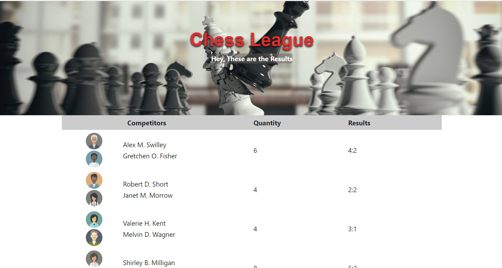

# Responsive-Design-Using-the-Bootstrap-Grid-System

1. **Nombres y apellidos:** Carola Casais Recondo
2. **Fecha:** Martes 8 de diciembre de 2020
3. **Resumen del Ejercicio:** El objetivo es crear un diseño responsive usando el sistema grid de bootstrap para crear la página de un torneo de ajedrez.
4. **Dificultad o problemas presentados y como se resolvieron:** No hubo dificultades en este ejericio.
